# **2Hand Thrift Store** 👕
**2Hand Thrift Store** is a web application for buying and selling second-hand clothing, featuring an integrated **auction system** and admin dashboard. This project is built by extending the ICN_FREEZE e-commerce template.

## ❤️ Live Demo

https://2hand-two.vercel.app/

## 🛠️ Tech Stack

**Frontend** 
* Next.js (React)
* TypeScript
* Tailwind CSS

**Backend**
* Node.js (runtime)
* Next.js API Routes

**Database** 
* Supabase (PostgreSQL) with Prisma ORM

**Authentication**
* JWT (stored in cookies)
* Google OAuth

**Architecture** 
* MVC Pattern (Models, Services, Controllers)

**Deployment** 
* Vercel

## 🚀 Installation

### 1. Clone the repository

```bash
git clone https://github.com/93bazmi/2hand.git
cd 2hand
```

### 2. Install dependencies

```bash
npm install
```

### 3. Set up environment variables

Create a `.env` file in the root directory and add:

```env
DATABASE_URL=your_supabase_database_url
JWT_SECRET=your_jwt_secret
NEXT_PUBLIC_BASE_URL=http://localhost:3000

# Google OAuth
GOOGLE_CLIENT_ID=your_google_client_id
GOOGLE_CLIENT_SECRET=your_google_client_secret
```

### 4. Set up database (Prisma)

```bash
npx prisma generate
npx prisma migrate dev --name init
```

### 5. Run the development server

```bash
npm run dev
```

Open in your browser:
http://localhost:3000

## 📸 Screenshots

### 🔐 Authentication (Login)

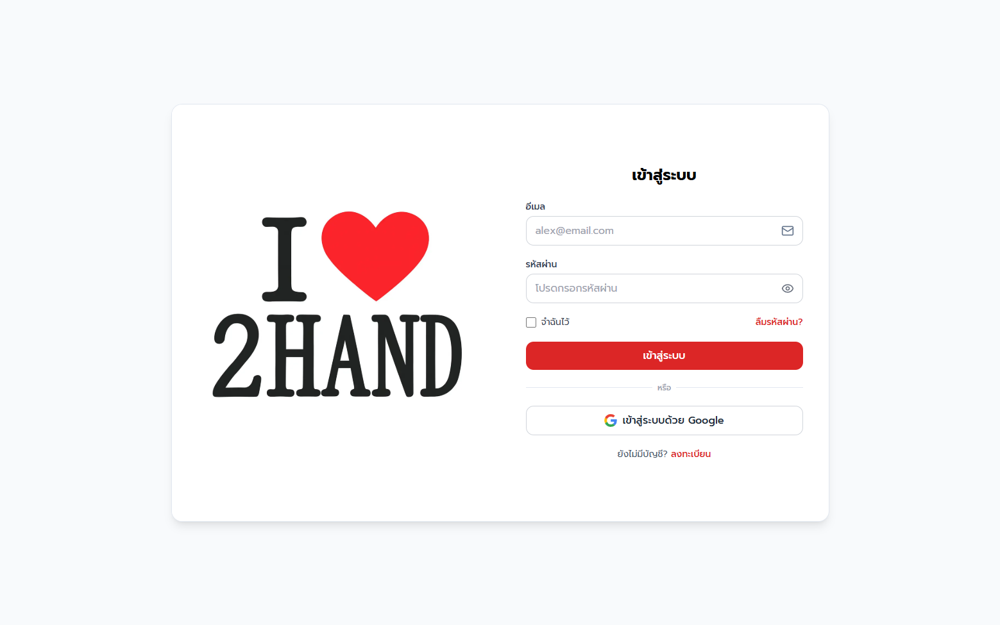


### 🏠 Home Page

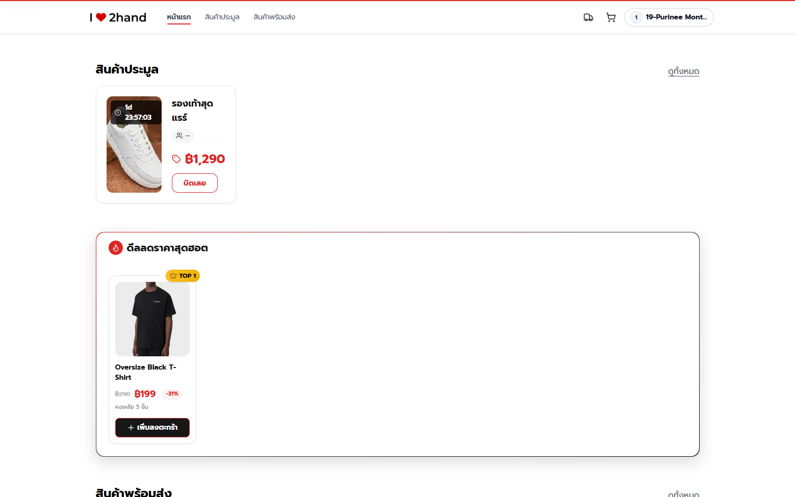

### 👕 Product Listing

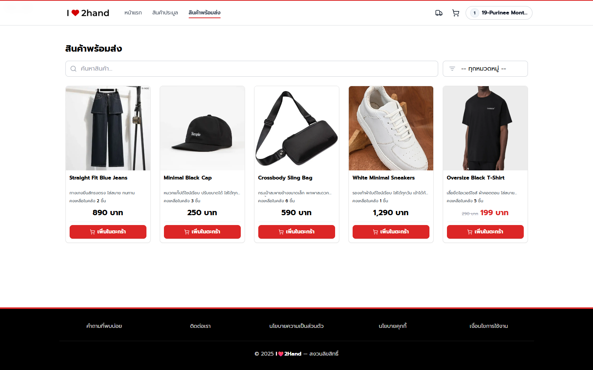

### 🔍 Product Detail

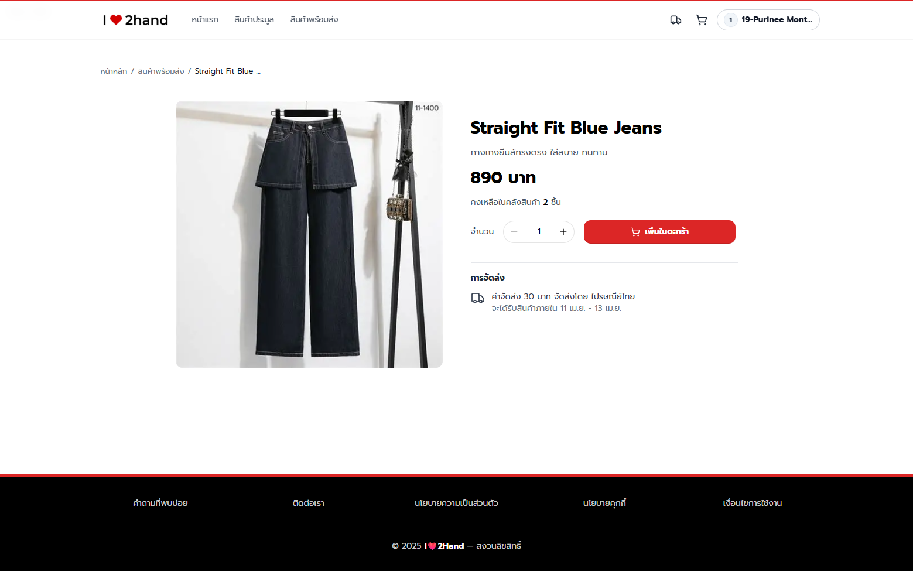

### 🔥 Auction System

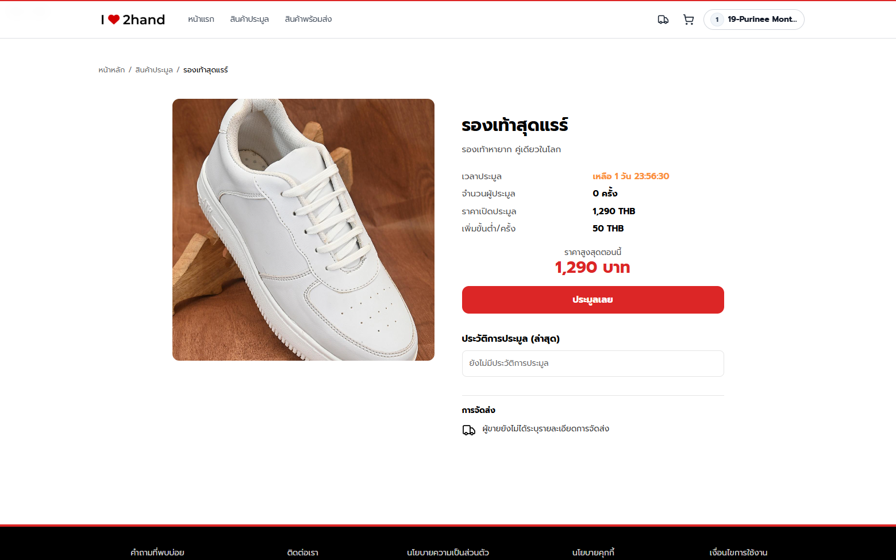
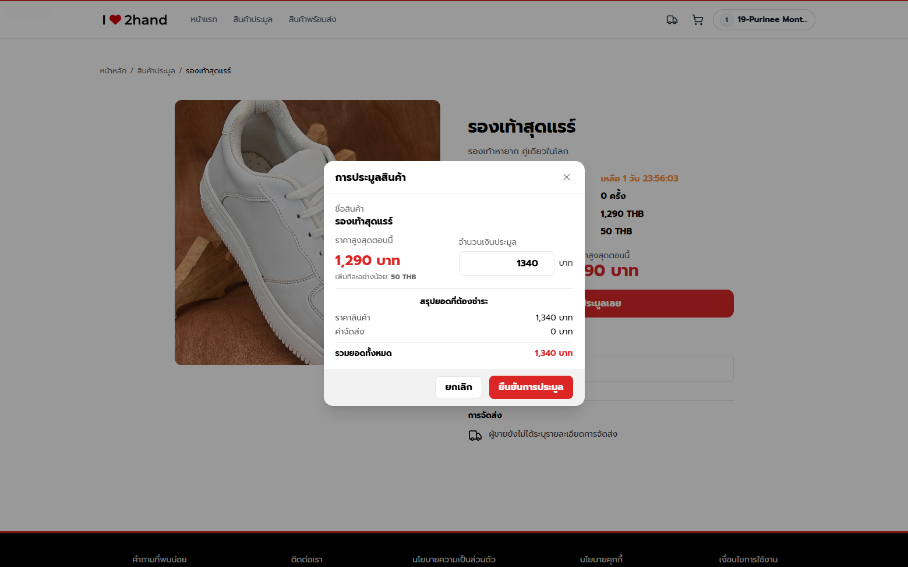

### 🛒 Shopping Cart

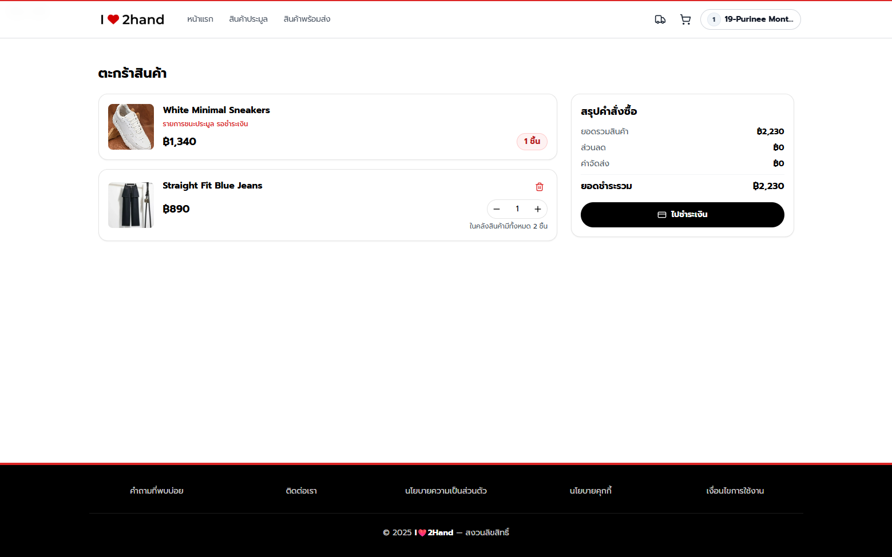

### 📦 Order Tracking

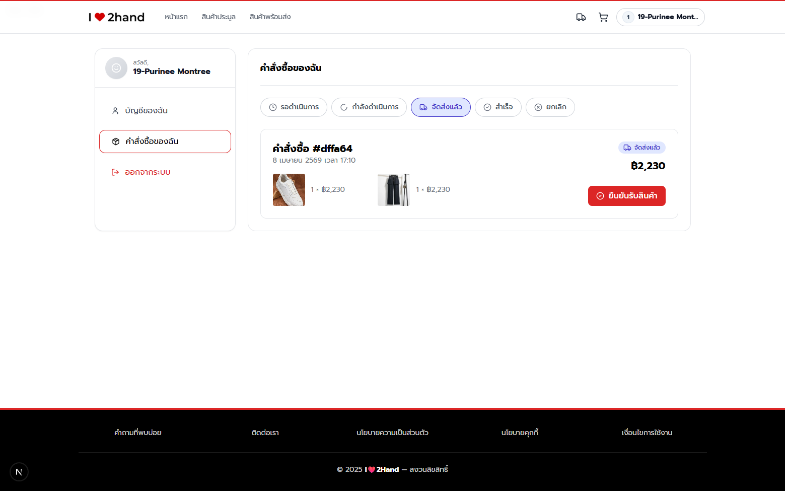

### 🗃️ Admin - Order Management

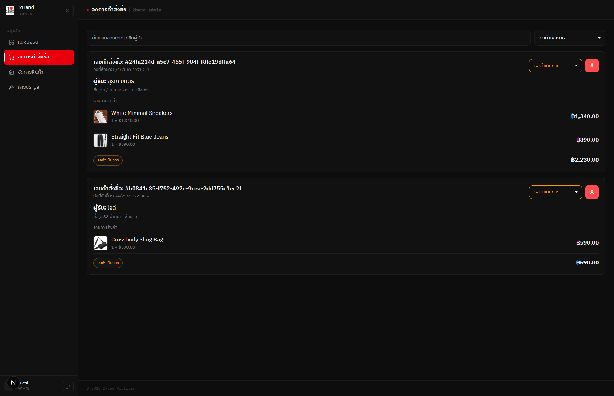

### 🛠️ Admin - Product Management

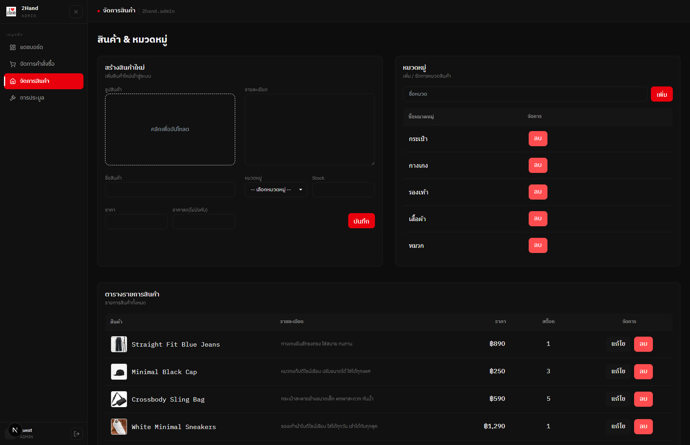

### ⚖️ Admin - Auction Management

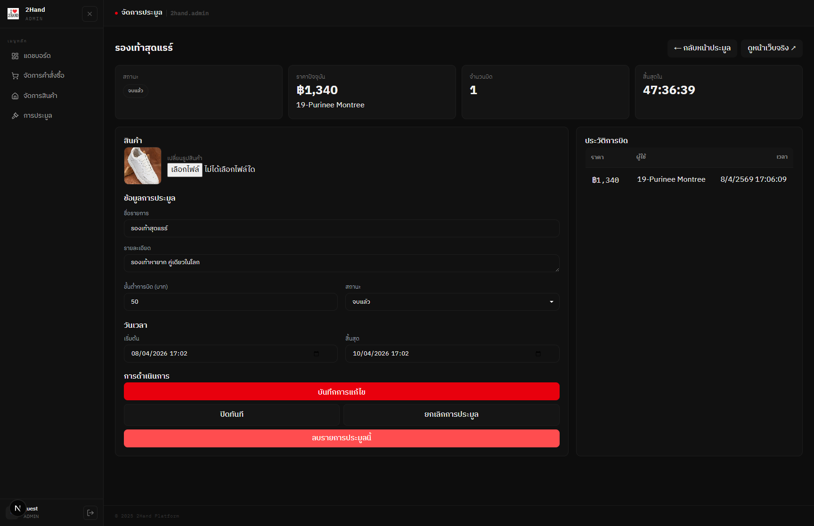


